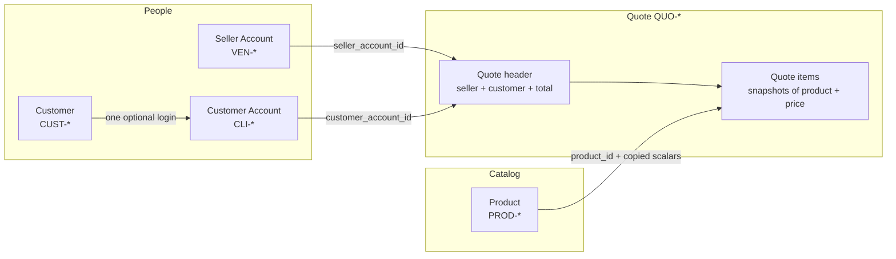
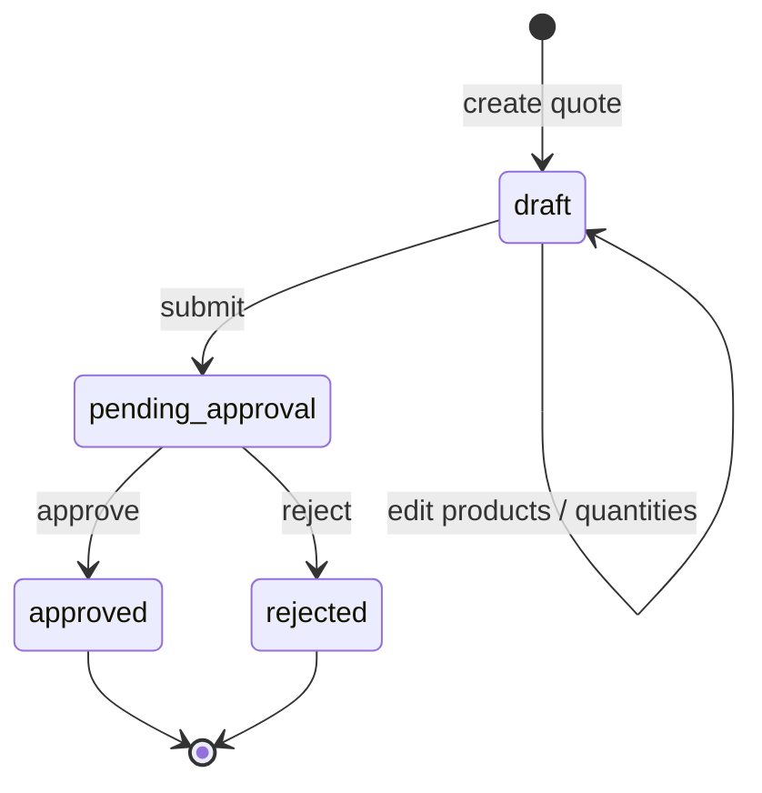
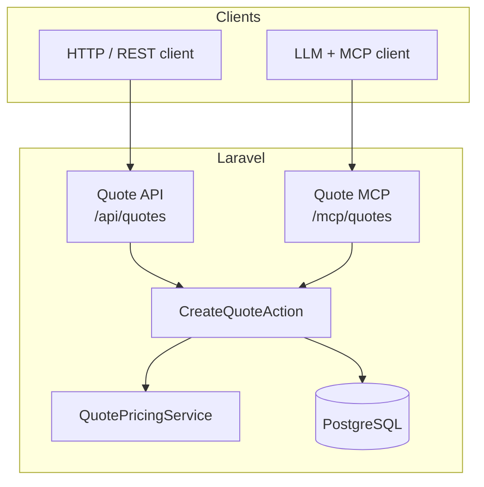
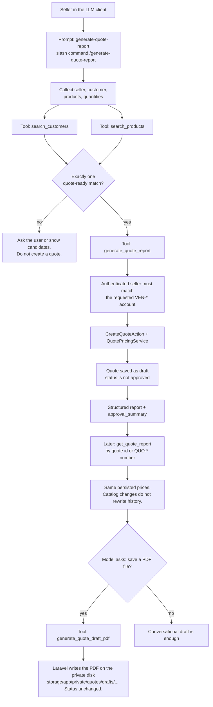
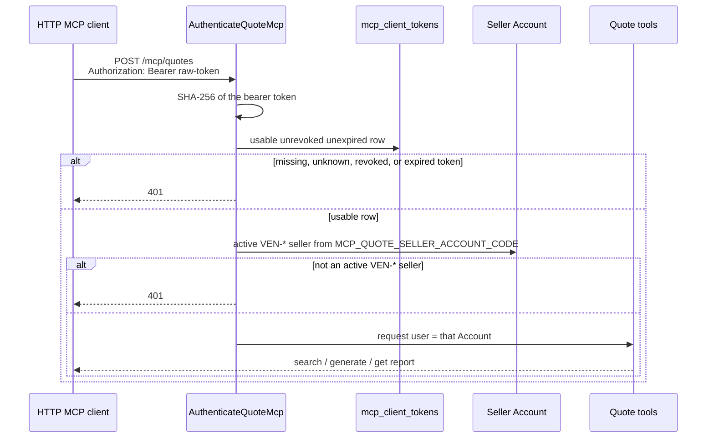

# How this quote system works

This project is a small sales domain with two doors into the same house.

One door is a REST API. Sellers and operators can manage products, customers, login accounts, and quotes through ordinary HTTP endpoints.

The other door is MCP. An LLM client talks to a quote server, looks up customers and products by name or public code, and asks the application to persist a quote report. That report is meant for a human to review and approve. Generating a report does **not** approve the quote.

Both doors create quotes the same way. Controllers and MCP tools do not invent their own math. They call `CreateQuoteAction`, which uses `QuotePricingService`, writes the quote and its items in a single database transaction, and snapshots product names, units, and prices onto each line. If the catalog price changes tomorrow, yesterday’s quote still shows what was actually offered.

There is no `users` table in this flow. `accounts` is the identity table. Sellers log in (or authenticate over MCP) as `VEN-*` accounts. Customers have a business profile in `customers` and, when they can log in, a matching `CLI-*` account.

---

## The pieces, in the order they were built

The work was split into six modules. Each one is useful on its own, but the later ones assume the earlier ones exist.

**Products** are a tiny catalog. A product has a stable public code (`PROD-000001`), a name, a unit, a decimal price, a three-letter currency, and an active flag. Search works by name or code because a seller (or an LLM) rarely starts with a database id.

**Customers** are business profiles, not logins. A customer has a public code (`CUST-000001`), a name, optional document and contact fields, and an active flag. Passwords do not live here. Search works by name, code, or document so MCP can resolve what a seller typed.

**Accounts** are the people who can authenticate. A seller account has type `seller`, a `VEN-*` code, and no customer link. A customer account has type `customer`, a `CLI-*` code, and exactly one customer. Email is unique and lowercase. Passwords are hashed and never returned by the API. Account age in days is calculated from `created_at`; it is not stored.

**Quotes** are the commercial document. A quote always points at two accounts: the seller who owns it and the customer who should approve it. Status moves in a straight line: `draft` → `pending_approval` → `approved` or `rejected`. Only drafts can still change products and quantities.

**MCP quote reports** are a conversation-friendly way to create and reread those quotes. The LLM is guided by a prompt (`/generate-quote-report`). The prompt never prices anything. Tools search the catalog, resolve public codes, then call the same create-quote action as REST.

**Seller notes ingest** is another way to start that same conversation. The home page (`GET /`) is a two-column PoC: left is a notes `.txt` template and UTF-8 upload; right is a Markdown guide for Claude Code and Codex (slash prompts, tools, and a future in-app LLM API). When mentions resolve uniquely, Laravel persists a draft through `CreateQuoteAction` (the same engine as MCP `generate_quote_report`) and shows the result on the page. MCP `ingest_seller_quote_notes` still only returns a briefing. Prices found in the notes are ignored. Obvious PII is stripped from the briefing. OCR of photos or scans is not in this system. An OpenAI-class HTTP client inside Laravel is not implemented.

**Static bearer tokens** exist because an LLM client talking over HTTP is not a logged-in browser session. The client sends a raw token in `Authorization`. Laravel stores only the SHA-256 hash, checks it in constant time, and attaches a configured active seller account to the request. Tools still check that the user is a seller.

**Vendor privacy** is a constraint on the MCP door, not a second quoting system. Tool results go to the MCP client and then into the LLM vendor conversation. Laravel withholds tax documents and contact PII from those payloads, redacts them from default logs, and still prices quotes from the database. Retention, training, and data-processing terms are contractual/client configuration; the application cannot enforce them on the vendor.

Seeders for products, customers, and accounts are idempotent: they `upsert` on public `code`, so you can seed twice without duplicates.

---

## Domain map

Public codes are the language humans and models should use. Internal ids stay inside the application.

```text
PROD-*   product in the catalog
CUST-*   customer profile (company / person)
VEN-*    seller account (login identity)
CLI-*    customer account (login identity, 1:1 with a customer)
QUO-*    persisted quote number
```

How those records connect:



A customer account cannot sell. A seller account cannot be the customer on a quote. Seller and customer on one quote cannot be the same account. Mixed currencies on one quote are rejected. Duplicate products on one request are rejected.

---

## Quote lifecycle

A new quote starts as a draft. Submit is the seller asking for a decision. Approve and reject are the customer-side decisions. Historical money comes from columns on `quote_items`, never from a live catalog lookup.



Creation is one transaction:

1. Validate seller, customer, products, quantities, and currency.
2. Generate a unique quote number (`QUO-YYYY-…`) in a concurrency-safe way.
3. Copy current product price, code, name, and unit onto each line.
4. Compute `line_total = quantity × unit_price` and `quote.total = sum(line totals)`.
5. Persist the header and all items together. If any item fails, nothing is kept.

Callers never supply `unit_price`, `line_total`, or `total`. The application is the source of truth for money.

---

## Two doors, one quote engine

REST lives in `routes/api.php`. MCP lives in `routes/ai.php`. Quote math lives in the domain layer.



That split is the main design rule. MCP is not a second quoting system. It is a lookup-and-report front end on top of the same persistence.

There is also a small general MCP server at `/mcp` (health check). Quote work goes to `/mcp/quotes`.

---

## How a seller talks to MCP

The user-facing command is `/generate-quote-report`. That is an MCP **prompt**, not an HTTP route and not the tool that writes the database.

A second command, `/generate-quote-from-notes`, starts from a notes file instead of typed chat. The seller can also copy the landing template and upload that file on the PoC landing (`GET /`). That POST stores the file and, when lookup is unambiguous, creates the draft on the server (no browser MCP token). Laravel stores the file under `storage/app/private/quotes/notes/`. Viewing the template does not write that folder. The MCP ingest tool still does not write a quote.

The model is supposed to collect missing pieces, search when a name is ambiguous, and only then call `generate_quote_report`. If two customers share a similar name, the tools return candidates. They do not guess.



Typical inputs the model (or the tool) can accept:

- Seller: `VEN-000001` (or inferred from the authenticated MCP user).
- Customer: `CUST-*`, `CLI-*`, or a unique name.
- Product: `PROD-*` or a unique name.
- Quantity greater than zero per line.
- Optional `valid_until` and `notes`.

A customer is quote-ready only when the profile is active **and** it has an active customer account. Searching customers through MCP returns that account code so the rest of the flow can stay on public identifiers.

---

## Authentication for the quote MCP

Local Claude Code uses stdio (`php artisan mcp:start quotes` from `.mcp.json`). In `local` and `testing` only, that process binds `$request->user()` from `MCP_QUOTE_SELLER_ACCOUNT_CODE`. Production stdio does not auto-bind a seller.

HTTP clients (`POST /mcp/quotes`) still require a usable `mcp_client_tokens` row. `MCP_QUOTE_TOKEN_HASH` does not authenticate Quote MCP.

The Laravel app never stores the raw HTTP token. The MCP client never puts the token in the prompt or in tool arguments.



On the server: `MCP_QUOTE_SELLER_ACCOUNT_CODE` and hashed rows in `mcp_client_tokens`.

On HTTP clients: `MCP_QUOTE_TOKEN` (the raw secret), minted via the administration API or `php artisan mcp:client-token:create`.

Middleware authenticates HTTP. Local stdio binds the configured seller. `RequiresSellerAccount` still authorizes. Throttling stays on the HTTP route. A customer account configured as the MCP identity is rejected. An inactive seller is rejected.

---

## Quote MCP and the LLM vendor (privacy)

Quote MCP is a third-party LLM data path. After Laravel returns a tool result, the MCP client typically includes that result in the conversation sent to the AI vendor. Local `stdio` (`php artisan mcp:start quotes`) and the authenticated web endpoint (`/mcp/quotes`) have the same payload exposure once the client forwards tool results to the model.

Laravel authenticates the client and minimizes what the model sees. It cannot see, limit, or delete what the vendor retains. Retention, training, evaluation, and data residency are contractual and client-configuration duties, not application runtime checks.

### Fields allowed to reach the LLM

- Customer search / ambiguous candidates: `customer_id`, `customer_code`, `customer_name`, `customer_account_id`, `customer_account_code`, `active`, and optional `document_present` (boolean only).
- Product search: identity (`id`, `code`, `name`), `unit`, catalog `price`, `currency`, `active`. No product `description`.
- Quote reports (structured and Markdown): public codes (`QUO-*`, `VEN-*`, `CUST-*`, `CLI-*`, `PROD-*`), display names, quantities, persisted `unit_price` / `line_total` / `total` / `currency`, notes, status, and `approval_summary`.
- Quote draft PDF: the same public fields as the report, rendered in Laravel. Tool text is metadata (`quote_number`, `status`, `total`, `currency`, `filename`) plus a short-lived download URL. PDF bytes are not placed in model-facing tool text.

Document remains a **search/resolve input**. A seller can type a tax/company document into `search_customers` or `generate_quote_report`. The stored document is not echoed back.

### Fields forbidden in MCP payloads

- Customer `document` values (full tax/company identifiers)
- Customer `email`, `phone`, `contact_name`
- Account passwords and password hashes
- MCP bearer tokens, token hashes, and `Authorization` headers
- Caller-supplied prices (`unit_price`, `line_total`, `total` on generate)
- Raw seller notes bodies, note prices, emails, phones, and document-like digit strings in `ingest_seller_quote_notes` output

REST customer resources may still return `document`, `email`, and `phone`. That is the operator HTTP door, not the AI vendor.

Default Laravel logs must not persist those withheld fields or bearer tokens. `Authorization` headers fail closed (redacted). Complete MCP request/response bodies are not logged at `debug`/`info` in the default configuration.

### Production checklist (operational, not enforced by Laravel)

- Written DPA or equivalent processing terms with the LLM vendor.
- Disable vendor training and evaluation on customer/quote content when the vendor offers that setting.
- Configure vendor retention to the shortest period the business accepts. Laravel cannot enforce vendor retention.
- Use the authenticated web MCP endpoint against this application. Do not paste production catalog or quote data into a personal LLM account or an unmanaged copy of the dataset.
- HTTPS outside local development (already required for the quote MCP web route).

---

## What each MCP tool is for

| Name | Role |
| --- | --- |
| `search_products` | Find active products by name or code. Cap results (max 10). Prefer exact codes. |
| `search_customers` | Find customers plus their `CLI-*` account. Document is search input only. Never return documents, emails, phones, contact names, or passwords. |
| `generate_quote_report` | Resolve codes, validate, persist one quote, return the report. |
| `get_quote_report` | Load by id or `QUO-*` number. Read stored money, do not reprice. |
| `generate_quote_draft_pdf` | Render a printable PDF of a persisted quote from stored snapshots and write it to the private local disk. Does not approve or reprice. |
| `ingest_seller_quote_notes` | Parse pasted UTF-8 or a private `quotes/notes/` file into a briefing (mentions, quantities, sanitized remainder). Does not persist a quote. Ignores prices. Redacts obvious PII from the model-facing result. |
| `generate-quote-report` | Prompt only. Teaches the model the create-and-review workflow. After the money draft, it must ask whether to save a PDF; it must not auto-save. |
| `generate-quote-draft-pdf` | Prompt only. Teaches the model to call `generate_quote_draft_pdf` for an existing `QUO-*` and not invent prices or PDF content. |
| `generate-quote-from-notes` | Prompt only. Teaches the model to ingest notes, search until unambiguous, persist only via `generate_quote_report` (never note prices), then the same money draft and PDF ask. |

Errors are meant to be specific: not found, ambiguous, inactive, wrong account type, bad quantity, duplicate product, mixed currency, unauthorized seller.

---

## REST surface (the operational door)

These modules also have CRUD (and quote workflow) under `/api`:

- Products: list with search/code/active, create, show, update, delete/inactivate.
- Customers: same idea, plus exact document and email filters.
- Accounts: list by type, search, create with generated `VEN-*` / `CLI-*` codes.
- Quotes: create, show, list, edit while draft, submit, approve, reject. A short-lived signed GET at `/api/quotes/{quote}/draft-pdf` downloads the Laravel-rendered draft PDF.

REST and MCP share the same tables and the same quote action. If you seed mock data, you can exercise either door against the same catalog.

---

## What this system deliberately does not do

No taxes, shipping, inventory, product variants, CRM, email delivery, or automatic LLM approval. Quote-draft PDF via `generate_quote_draft_pdf` is in scope; emailing that PDF is not. Notes ingest is UTF-8 `.txt` / `.md` (welcome upload or paste); OCR of images or handwritten scans is out of scope. No OAuth or Sanctum for Quote MCP (usable `mcp_client_tokens` rows for HTTP, configured seller for local stdio). No `user_id`. No JSON metadata columns on these tables.

Those omissions keep the quote report small enough that an agent can create it without inventing commercial rules the business has not specified yet.

---

## A short walk-through

Imagine a seller in Cursor or another MCP client:

1. The client is already configured with `MCP_QUOTE_TOKEN` and talks to `/mcp/quotes`.
2. The seller types `/generate-quote-report` and says they need a quote for Acme, three premium keyboards.
3. The model calls `search_customers` with “Acme”. One active customer with a `CLI-*` account comes back.
4. It calls `search_products` with “premium keyboard”. One active `PROD-*` comes back.
5. It calls `generate_quote_report` with the seller’s `VEN-*` code, that customer, that product, and quantity 3.
6. Laravel hashes the bearer token, attaches `VEN-000001` (or whichever seller is configured), checks the seller is allowed to create that quote, snapshots the current keyboard price, and stores `QUO-2026-000001` as a **draft**.
7. The model returns a report with persisted unit prices, line totals, total, and currency. The seller can later fetch it with `get_quote_report`.
8. After that draft, the model asks whether the seller wants to save a PDF file. It does not generate a PDF until the seller says yes (or already asked for one). On yes, it calls `generate_quote_draft_pdf`. Laravel writes `storage/app/private/quotes/drafts/{quote_number}-draft.pdf` on the `local` disk and returns metadata (path, filename, money, optional short-lived download URL). Saving the PDF does not approve the quote.
9. Sellers who already have a `QUO-*` can still use `/generate-quote-draft-pdf` without creating a new quote. That path writes to the same private folder.
10. Approval still happens through the quote workflow, not by generating the report or the PDF.
11. Alternatively, the seller uses the PoC landing on `GET /`. Wide screens put the notes path on the **left** (steps, template, upload) and Claude/Codex MCP setup on the **right**. After upload, Laravel writes `quotes/notes/{ulid}.txt`, ingests a briefing, and if catalog matches are unique, persists a draft with the same create engine as `generate_quote_report`. The page shows `QUO-*` and catalog money. The quote is not approved until the seller clicks **Approve** on that page, which runs `SubmitQuoteAction` then `ApproveQuoteAction` (REST workflow). Upload, `generate_quote_report`, and ingest do not approve. REST `/api/quotes/{quote}/approve` stays customer-only. Note prices and obvious PII do not become quote prices or page PII. Ambiguous notes do not persist.

That is the whole solution: a catalog and identities with public codes, a quote engine that snapshots prices, and an authenticated MCP front end that searches in natural language and then writes the same quote a REST client would write.
